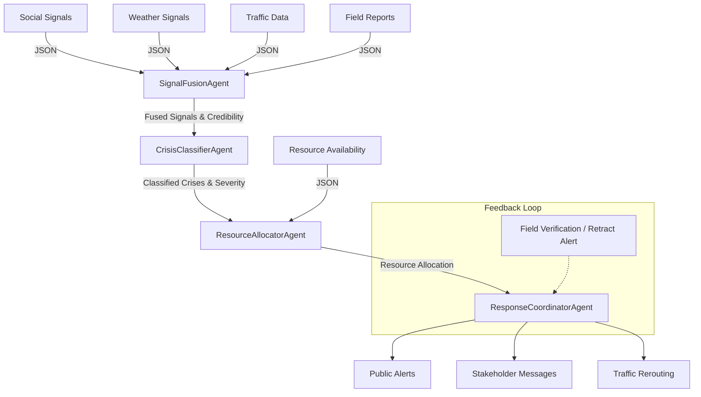

# CIRO — Crisis Intelligence & Response Orchestrator

## Project Overview
CIRO is an autonomous, multi-agent orchestrator designed to detect, classify, and respond to urban crises in Islamabad and Rawalpindi. By intelligently fusing multi-source signals (social media, weather data, traffic APIs, and field reports), CIRO accelerates emergency response times, resolves conflicting on-the-ground reports, and efficiently allocates constrained resources before human dispatchers even receive the initial alert.

## Architecture Diagram

## All 4 Agents Explained
1. **SignalFusionAgent**: Ingests raw mock data from multiple sources. It scores credibility based on source type and recency, filters out noise, and identifies conflicting reports (e.g., social media claiming "flooding" vs. field reports stating "water main burst" in G-10).
2. **CrisisClassifierAgent**: Receives fused data and explicitly classifies the incidents. It scores severity, handles conflicts gracefully without forcing a single incorrect conclusion, and predicts how the crisis might evolve (e.g., affected radius, population at risk).
3. **ResourceAllocatorAgent**: Analyzes the severity of multiple concurrent crises against constrained resources (ambulances, rescue teams, water tankers). It calculates travel times and explicitly documents the trade-offs made (e.g., prioritizing immediate life-safety in a heatwave over property damage in a flood).
4. **ResponseCoordinatorAgent**: Takes the allocation plan and generates actionable outputs. This includes bilingual public alerts (Urdu/English), intelligent traffic rerouting, and tailored dispatches for stakeholders (Police, WASA, Rescue 1122, Hospitals).

## APIs and Tools Used
- **Google Gemini API**: Powers the reasoning engine for all 4 agents (models used: `gemini-1.5-flash` for initial fusion, `gemini-2.0-flash` for complex classification and orchestration).
- **Firebase Cloud Functions**: Hosts the serverless agent pipeline.
- **Firebase Realtime Database**: Acts as the system memory, storing all agent traces and final actions.
- **Node.js**: Backend runtime environment.
- **Google Antigravity**: Used as the AI pair-programming assistant to rapidly build and iterate on the agent architectures.

## Mock Data Explanation
To safely simulate emergency scenarios without triggering real-world panics, CIRO uses strictly labeled JSON mock data.
- **social_signals.json**: Simulated tweets and Facebook posts regarding water accumulation.
- **weather_signals.json**: Simulated extreme temperature readings (47°C in Saddar).
- **traffic_signals.json**: Simulated gridlock metrics.
- **resources.json**: Current availability of ambulances, police, and rescue teams.
*(All mock data is clearly labeled with `// MOCK DATA` to prevent any misinterpretation).*

## Cost and Latency Analysis

| Metric | Without CIRO (Human Dispatch) | With CIRO (AI Agents) |
|---|---|---|
| Initial Signal Triage | 5-10 minutes | < 2 seconds |
| Conflict Resolution | 15-30 minutes | ~3 seconds |
| Resource Allocation | 5-10 minutes | ~2 seconds |
| Stakeholder Dispatch | 5-15 minutes | < 1 second |
| **Total Response Time** | **30-65 minutes** | **~8 seconds** |
| API Cost per Incident | N/A | ~$0.002 (Gemini API) |

## Baseline Comparison
- **Without CIRO**: Dispatchers are overwhelmed by conflicting social media posts. Resources might be dispatched to a "flood" only to arrive and find a "water main burst," wasting critical heavy rescue units. Heatwave responses are reactive.
- **With CIRO**: The system flags the conflict immediately, sends a single lightweight verification team to the water incident, and proactively reroutes ambulances to the extreme heatwave in Saddar.

## Antigravity Usage
Google Antigravity was leveraged to accelerate the development of CIRO. It was used to:
- Rapidly scaffold the Firebase Cloud Functions environment.
- Generate structured system prompts enforcing strict JSON outputs.
- Implement robust fallback logic and error handling.
- Build the sequential testing pipeline (`test_agent.js`).

## Setup Instructions
1. Clone the repository.
2. Navigate to the `functions` directory: `cd functions`
3. Install dependencies: `npm install`
4. Set up your Gemini API Key in a `.env` file: `GEMINI_API_KEY=your_key_here`
5. Run the local test pipeline: `node --env-file=.env test_agent.js` (Or simply `node test_agent.js` to see the fallback rule-based logic).

## Limitations
- The system currently relies entirely on mock data; integrating real-time live APIs (like Twitter or Google Maps) requires enterprise access and strict rate limiting.
- The resource travel time calculation is a straight-line approximation and does not dynamically query live traffic conditions for routing.

## Privacy Note
All generated data, including locations, names, and scenarios, are entirely fictional and designed exclusively for the purpose of this hackathon demonstration. The system does not ingest or process any real PII (Personally Identifiable Information).
